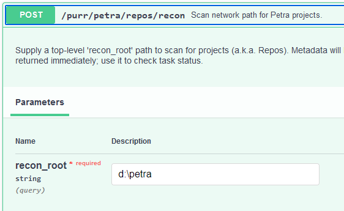
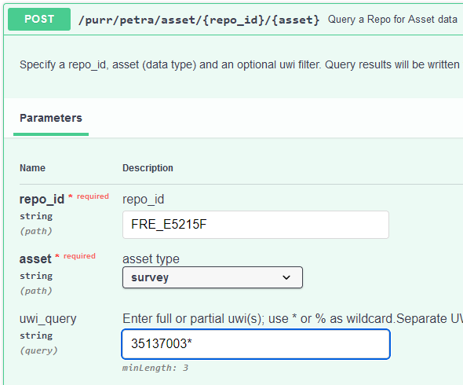

# purr_petra


|  | | **PETRA** |
|:--:|:--:|:--:|

---

<!-- |  |  | **PETRA** |
|:--:|:--:|:--:|

 
  -->


Use **purr_petra** to locate and query any Petra project* with zero setup via a
simple Python API. It's the missing
middleware [API](https://rbhughes.github.io/purr_petra/) for taming an unruly
geoscience data environment.

* #### Dynamic discovery and query of projects (even lost, unshared)
* #### Simple Python API
* #### No license checkouts
* #### Well-centric exports to JSON:

```
- core
- dst
- formation
- ip
- perforation
- production
- raster_log
- survey
- vector_log
- well
- zone
```

* _Each [Petra](https://www.spglobal.com/commodityinsights/en/ci/products/petra-geological-analysis.html) "project" is a semi-structured collection
  of E&P assets that interoperate with its own
  [DBISAM](https://www.elevatesoft.com/products?category=dbisam)
  database. From an IT perspective, Petra is a distributed collection of
  user-managed databases "on the network" containing millions of assets._

## Quickstart

**PREREQUISITE**: You'll need a DBISAM v4 ODBC driver. A bare-bones, 64-bit only 
install of v4.48 is provided here for evaluation, but you should probably get
the real thing from [Elevate Softare](https://www.elevatesoft.com/sales).


1. Launch cmd prompt (right-click Command Prompt | Run as administrator)
2. cd to the `odbc` directory in this library
3. run `python setup.py`
---


### install

`pip install purr_petra`
or
`poetry add purr_petra`

### launch:

`uvicorn purr_petra.main:app --workers 4`

**purr_petra** uses [FastAPI](https://fastapi.tiangolo.com "FastAPI").
You can test-drive your local API at: `http://localhost:8000/docs` after install.

## Usage

#### 1. Do a POST `/purr/petra/repos/recon` with a network path and server hostname

The path can be a top-level container of Petra projects or just a project itself.
NOTE: _We use the term **repo** and **project** interchangeably_



or

```
curl -X 'POST' \
  'http://localhost:8000/purr/petra/repos/recon?recon_root=d%3A%5Cpetra' \
  -H 'accept: application/json' \
  -d ''
```

_(Replace single quotes with double-quote for Windows)_

This might take a few minutes, so you get a `202 Reponse` containing a task id and task_status:

```
{
  "id": "4792ff33-fe6d-4938-bb95-4257b99f6ec0",
  "recon_root": "D:\\petra",
  "task_status": "pending"
}
```

Metadata for each [repo](./docs/fred.json) is stored in a local (sqlite)
database.

#### 2. Use the task id to check status with a GET to `/purr/petra/repos/recon/{task_id}`

```
{

  "id": "4792ff33-fe6d-4938-bb95-4257b99f6ec0",
  "recon_root": "D:\\petra",
  "task_status": "completed"
}
```

Possible status values are: `pending`, `in_progress`, `completed`, or `failed`.

#### 3. Use the `repo_id` to query asset data in a repo. Add a UWI filter to search for specific well identifiers.



This can also be time-consuming, so it returns a `202 Response` with a task id and the
pending export file.

```
{
  "id": "0c2fdd2e-70b4-4eb3-8e59-dcfa8983b70d",
  "task_status": "pending",
  "task_message": "export file (pending): fre_e5215f_1727127449_survey.json"
}

```

#### 4. Check asset export with a GET to /purr/petra/asset/{repo_id}/{asset}

Like `repo/recon`, this returns a tast_status and task_message containing exported file
info.

```
{
  "id": "0c2fdd2e-70b4-4eb3-8e59-dcfa8983b70d",
  "task_status": "completed",
  "task_message": {
    "message": "json docs written: 1",
    "out_file": "c:\\temp\\fre_e5215f_1727127449_survey.json"
  }
}
```

All asset data is exported as a "flattened" JSON representation of the original
relational model. Here's a [survey](./docs/survey.json) example.

## Future

Let me know whatever you might want to see in a future release. Some ideas are:

* Better query logic: match terms with `AND` instead of `SIMILAR TO` (`OR`)
* Structured ASCII (Petra PPF or GeoGraphix ASCII3) exports instead of JSON
* Full Text Search
* Datum-shift and standardize on EPSG:4326 for polygon hull points
* Auto-sync with your PPDM or OSDU store?
* Standardize a multi-project interface with Spotfire

## License

```
MIT License

Copyright (c) 2024 Bryan Hughes

Permission is hereby granted, free of charge, to any person obtaining a copy
of this software and associated documentation files (the "Software"), to deal
in the Software without restriction, including without limitation the rights
to use, copy, modify, merge, publish, distribute, sublicense, and/or sell
copies of the Software, and to permit persons to whom the Software is
furnished to do so, subject to the following conditions:

The above copyright notice and this permission notice shall be included in all
copies or substantial portions of the Software.

THE SOFTWARE IS PROVIDED "AS IS", WITHOUT WARRANTY OF ANY KIND, EXPRESS OR
IMPLIED, INCLUDING BUT NOT LIMITED TO THE WARRANTIES OF MERCHANTABILITY,
FITNESS FOR A PARTICULAR PURPOSE AND NONINFRINGEMENT. IN NO EVENT SHALL THE
AUTHORS OR COPYRIGHT HOLDERS BE LIABLE FOR ANY CLAIM, DAMAGES OR OTHER
LIABILITY, WHETHER IN AN ACTION OF CONTRACT, TORT OR OTHERWISE, ARISING FROM,
OUT OF OR IN CONNECTION WITH THE SOFTWARE OR THE USE OR OTHER DEALINGS IN THE
SOFTWARE.
```


```
DBISAM License

Clients of S&P Global's PETRA Software are assumed to have accepted Elevate
Software's License Agreement(s) for DBISAM under whatever terms set forth by
GeoPLUS, IHS and/or S&P Global. Use of **purr_petra** does not supersede those
agreements.
```